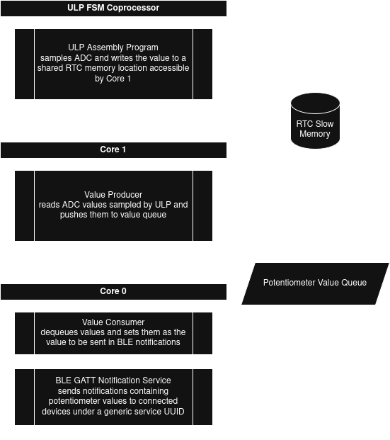

# BLE Potentiometer Service

This is a demonstration project to showcase the following skills:
- Embedded C
- Realtime systems (FreeRTOS)
- Asymmetric multiprocessing using the ESP32 ULP coprocessor and both CPU cores
- Producer/consumer pattern using a FreeRTOS Queue for passing data
- Bluetooth Low Energy GAP and GATT services for sending notifications to connected device

The premise is to distribute the value of a dial (potentiometer) via BLE

# Design

The design is contrived in order to demonstrate asymmetric multiprocessing and a 
producer/consumer pattern. It could easily be simplified but that's not the point.

## ADC Sampling by ULP Coprocessor

Frequency: 20Hz

The ULP FSM coprocessor on the ESP32 uses a custom instruction set. Though 
it is technically possible to compile C code into ULP-compatible assembly, 
the recommendation is to write the ULP program in assembly using the custom 
instructions documented in the ESP32 technical reference manual. 

See [main/ulp/adc.S](main/ulp/adc.S) for the ULP program.

This program executes every 200ms (5Hz). It samples the potentiometer ADC 
and stores it in RTC Slow Memory, which is accessible by both the ULP and main 
CPU cores.

## Producer Sends Data to Queue

Core: 1
Priority: 5
Frequency: 5Hz

The Producer task is pinned to Core 1 and polls at 5Hz the RTC Slow Memory ADC value 
written by the ULP program. This means it spends most of its time in a delay, 
which consumes very little processor power. Every time it reads an ADC value, 
it checks to see if the value has changed beyond a tolerance. If it has, it takes 
the new value and pushes it into a data queue.

See [main/producer.c](main/producer.c) for the producer

## Consumer Reads Values from Queue

Core: 0
Priority: 4
Frequency: 10Hz

The Consumer task is pinned to Core 0 to demonstrate running different services on 
separate cores. At a 10Hz cadence, it attempts to dequeue a value from the data 
queue. If a value is available, it sets it as the value of `potentiometer_value`,
which is referenced by the BLE stack when sending a notification for the 
configured GATT service characteristic.

Note: By dequeuing values relatively fast, we ensure that the consumer 
is always ahead of the producer.

See [main/consumer.c](main/consumer.c) for the consumer

## BLE Stack (NimBLE) Sends Values via Notifications

Core: 0
Priority: 5
Frequency: 2Hz

A task that sends the notification message via the BLE stack is priority 5 but 
exits immediately if there is no active connection.

See [main/gatt_svc.c](main/gatt_svc.c) `send_potentiometer_notification` for the
task function that sends the notification.

# Resources

Most of the GAP and GATT service code for BLE and the template for initializing 
the ULP FSM coprocessor is adapted from the Espressif examples here: 
https://github.com/espressif/esp-idf/tree/master/examples

The BLE aspect wasn't the primary focus of the exercise but I ended 
up learning a lot more about BLE than I expected.
